# Airbnb Clone - Group project at university with [Got It Vietnam](https://vn.got-it.ai/)

> [Airbnb](https://www.airbnb.com) is a vacation rental and room rental service that allows users to rent out their houses or rooms to travellers, that can search for accommodations by location to find a place to rent.

> The aim of project is desgin and implement a web application that provide some basic function like airbnb. Such as:

- For traveler(guests): Search and book accommodations
- For owner: Create listing and rent out their space

---

## Finish date:

- **May 2019**

---

## Completed Features:

- **User Authentication (Signup/Login)** - [Demo](demo/auth)
- **Home page** - [Demo](demo/homepage/home.png)
- **Create and edit listings** [Demo](demo/create-listing)
- **Search listing by multiple filter options** [Demo](demo/searching)
- **Full listing details** [Demo](demo/listing)

  - Room picture with slideshow
  - Room description
  - Customer reviews
  - Amentities/Beds
  - Availability calendar
  - Location map
  - Booking card

- **Booking** [Demo](demo/listing)

- **Booked list** [Demo](demo/bookinglist/booking.png)

---

## Team:

- [Nghia Ngo Trung](https://github.com/NghiaNT18) (Backend)
- Son Do Hong (me) (Frontend / System Design)

---

## TechStack:

- Frontend UI:
  - Language: Javascript
  - React(CRA)
  - Material UI (^v4.0.rc :awesome)
  - Styled component (^v4.x)
  - Redux (React-redux)
  - React-router (^v5)
  - Notable npm package: Google maps, react-dates
- Backend API:
  - Language: Python
  - Flask:
  - Authentication: JWT
  - SQL Alchemy
  - Database: Mysql
- REST API
- Deployment:
  - Docker
  - Docker-compose
  - AWS: (Demo)

---

## Demo:

- **User Authentication (Signup/Login)**
  
  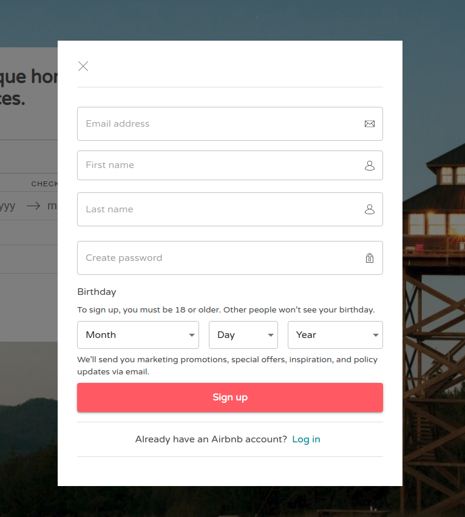

---

- **Home page** - [Demo](demo/homepage/home.png)
  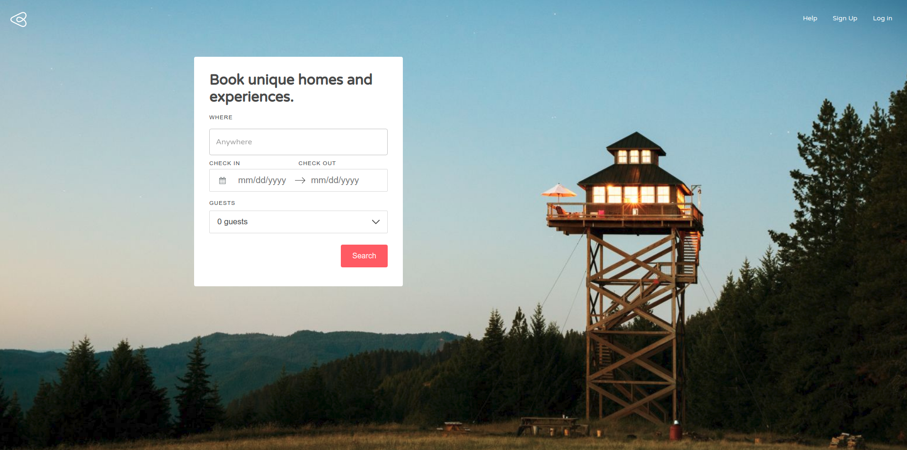

---

- **Create and edit listings**
  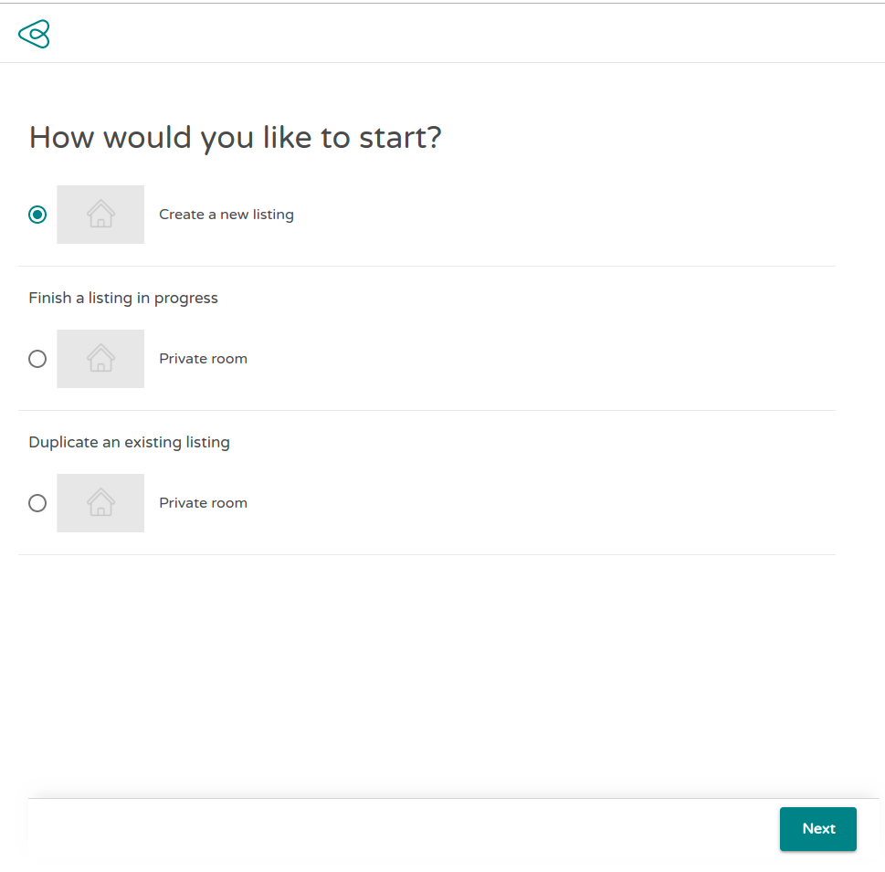
  
  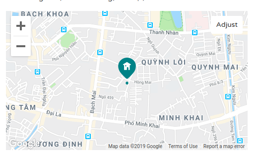
  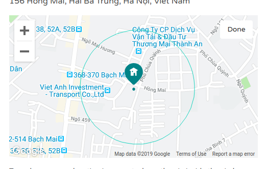

---

- **Search listing by multiple filter options**
  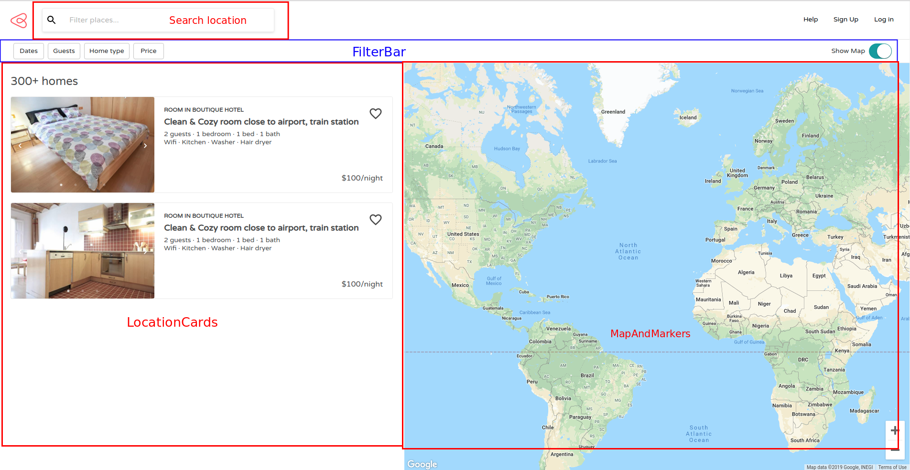
  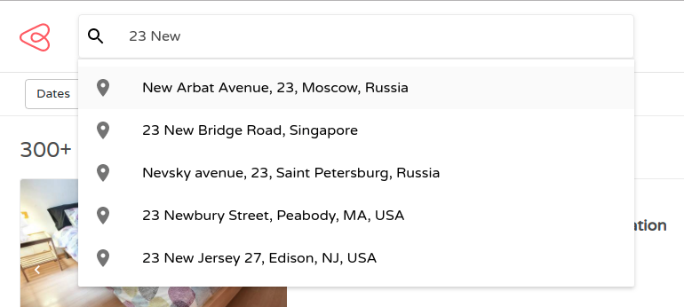
  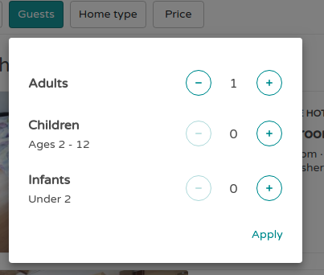
  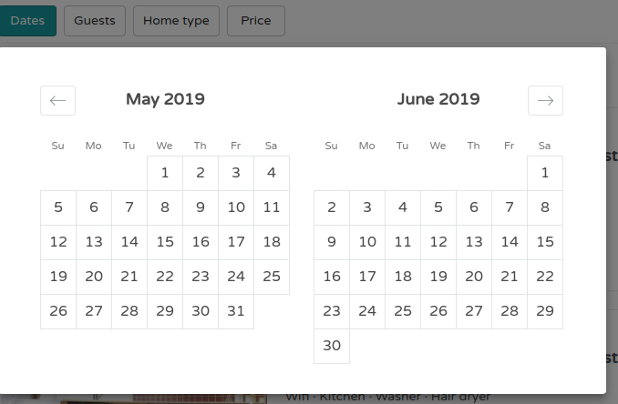
  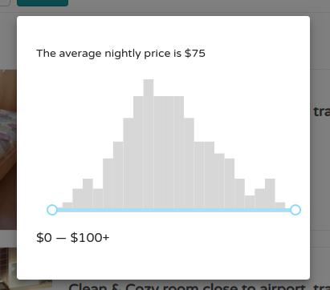
  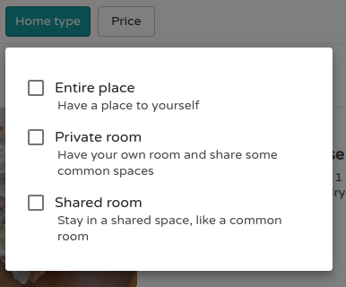

---

- **Full listing details**
  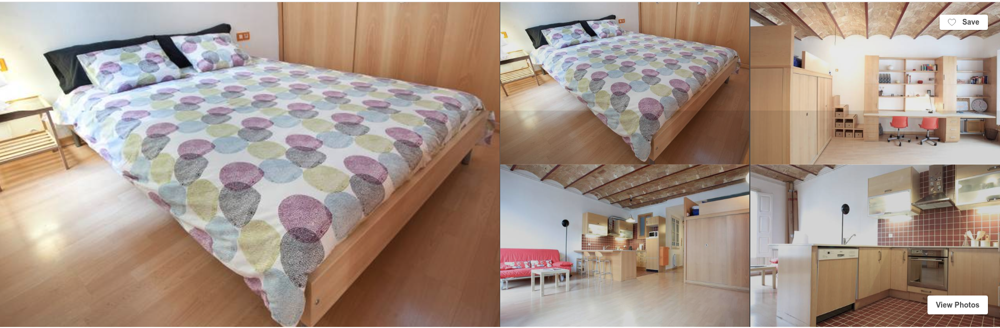
  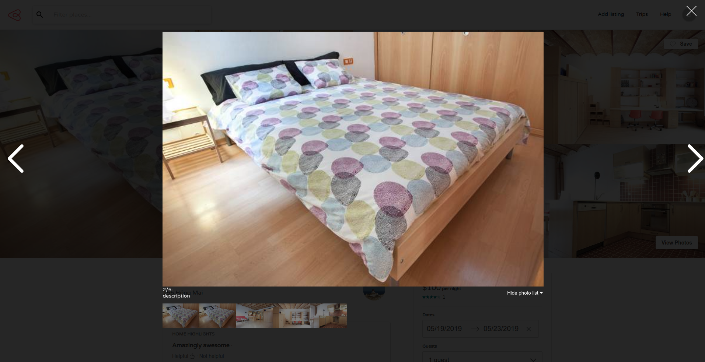
  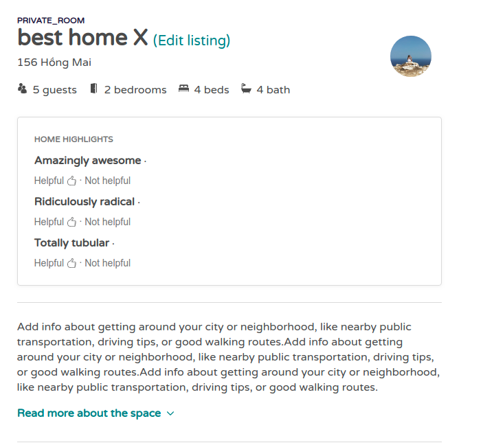
  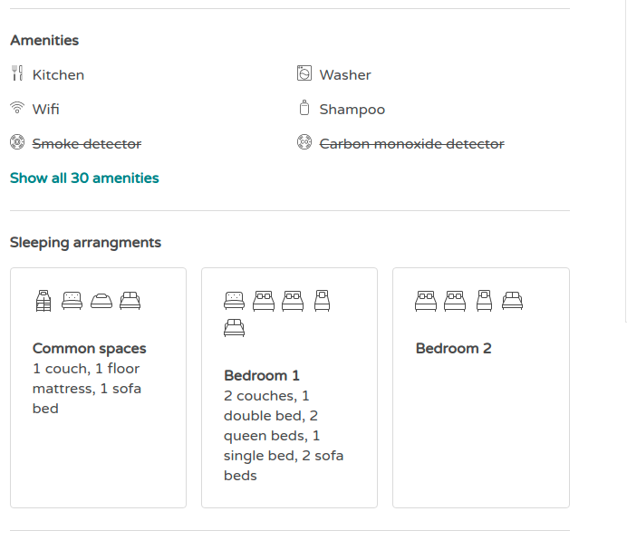
  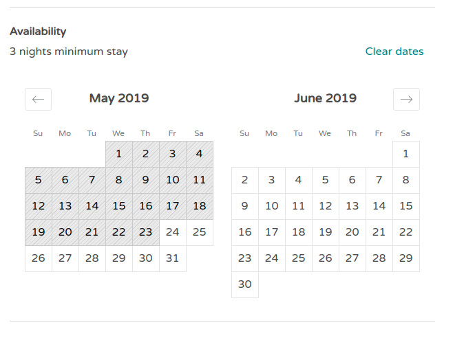
  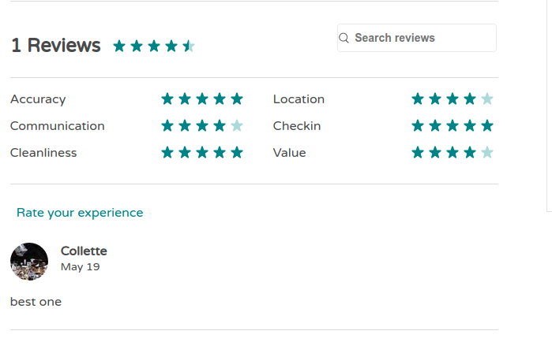
  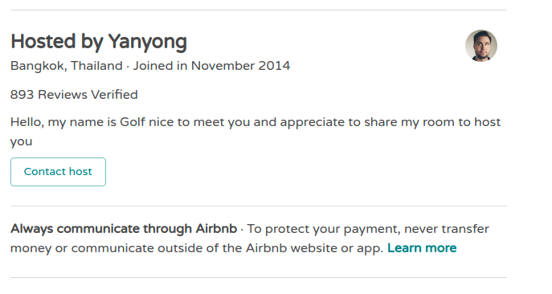
  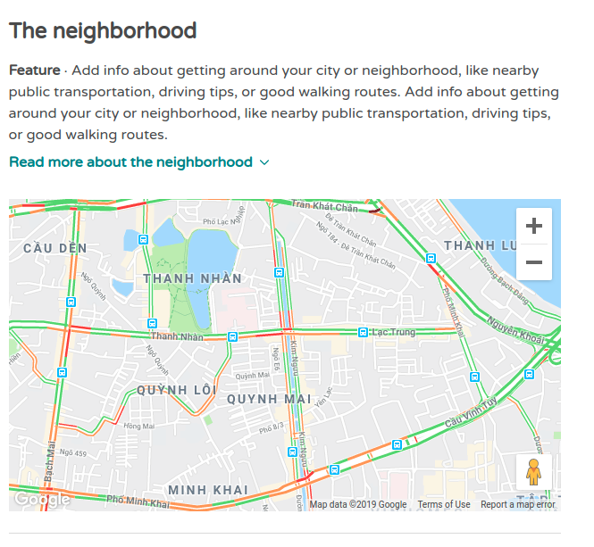

---

- **Booking**

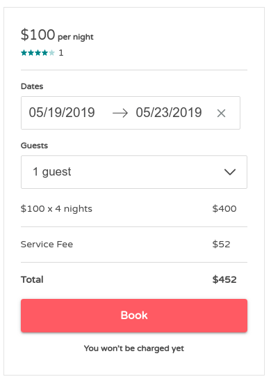
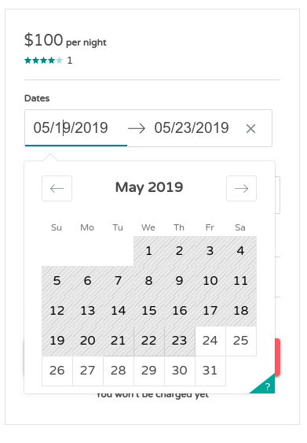
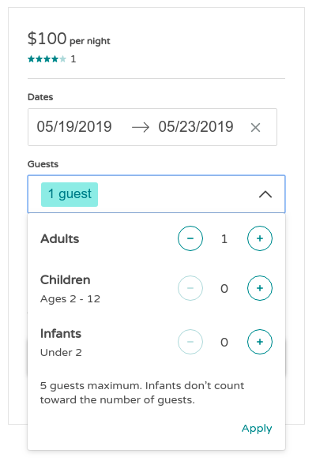

---

- **Booking list**
  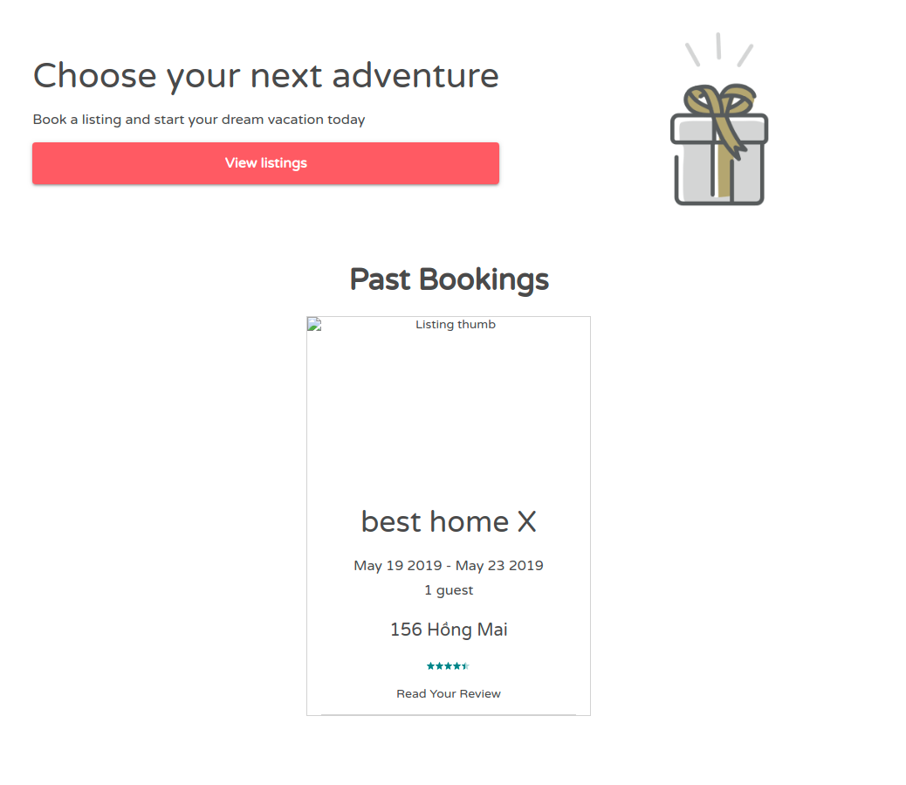
